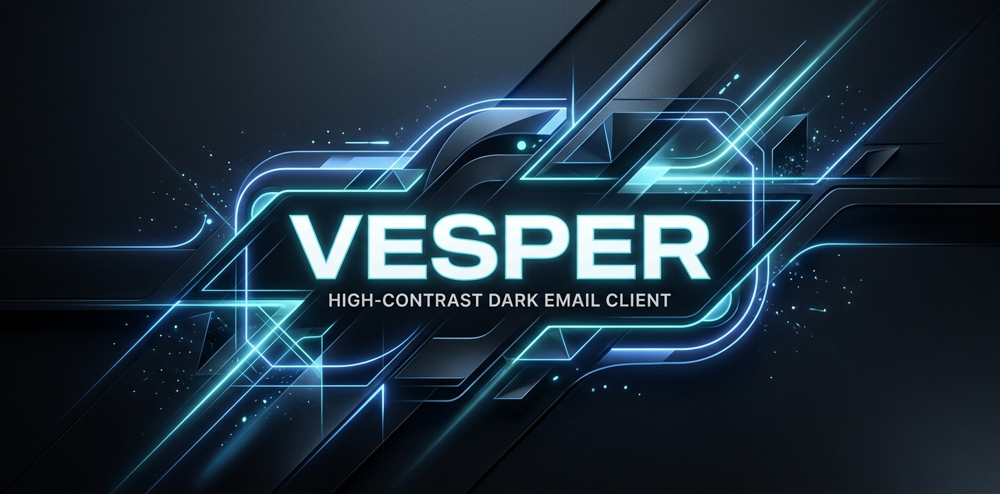

# <p align="center"></p>

<div align="center">
  <h1>🌌 Vesper Mail Client</h1>
  <p><strong>Rethinking email triage via context-aware spatial grouping, semantic filtering, and cognitive ergonomics. Built for high-agency operators.</strong></p>

  <p>
    
    
    
    
    
  </p>
</div>

---

## 🎨 Visual Identity & Aesthetic Alignment
Vesper marries a **Swiss Modern** structural layout with a **Cosmic Dark Slate** color system. The application features:
- **Intensive Typography Pairing**: Bold `Space Grotesk` display typography for structured section headings paired with `JetBrains Mono` and `Inter` for content lists and real-time status indicators.
- **Micro-interactions with Motion**: Smooth physical-like interactive card transitions, hover gradients, and subtle fade effects powered by `motion` and `GSAP`.
- **Frictionless Scroll Physics**: Integrated `lenis` to deliver a zero-friction, smooth inertial scrolling experience across large datasets.

---

## 💎 Key Architectural Features

### 📨 1. Interactive macOS Inbox Mockup
- Beautiful spatial email listing including **Semantic High-Triage Labels** (Focus, Personal, Newsletters, Logistics).
- Real-time interaction panels allowing filtering by Category, search queries, and simulated email inspection with smooth sliding state drawers.
- Aesthetic details honoring macOS-style dark interfaces with clean subtle glass-refinement borders.

### ⚡ 2. Keyboard-Focus & Spatial Triage Showcase
- An interactive tactile experience showing how high-agency operators navigate Vesper.
- Live demonstration of keyboard hotkeys (`Ctrl + K` Command Bar, `R` Speed Reply, etc.) allowing users to feel the efficiency of 4ms indexing.

### 📑 3. Full-Featured On-Page Platform Modules
Accessible directly from the sticky, floating capsule header navigation menu, the platform modules include:
- **Internal Journal (Blog)**: Technical papers detailing Vesper's Local-First sync engines and design philosophies. Includes a **fuzzy-filtering search bar** and isolated deep article view states.
- **Developer Center (Docs)**: API schema logs regarding client initialization. Built-in **interactive multi-language code playground** featuring quick tab switches between **JavaScript SDK**, **Go SDK**, or pure **cURL commands**.
- **Open Listings (Careers)**: Live operational roles complete with team parameters, location requirements, and compensation structures. Features a complete **active job application portal** showcasing interactive validation, resume link capture, and immediate receipt feedback.

---

## 🛠️ Stack & Dependencies
The following frameworks and libraries power the Vesper experience:
* **Frontend Core**: [React 19](https://react.dev/) + [TypeScript](https://www.typescriptlang.org/)
* **Build System**: [Vite 6](https://vite.dev/)
* **Styling Engine**: [Tailwind CSS v4](https://tailwindcss.com/)
* **Animations**: [GSAP 3](https://gsap.com/) & [Motion (Framer Motion)](https://motion.dev/)
* **Smooth Scrolling**: [Lenis](https://lenis.darkroom.engineering/)
* **Iconography**: [Lucide React](https://lucide.dev/)

---

## 🚀 Quickstart & Development Setup

### 1. Requirements
Ensure you have `Node.js` (v18 or higher) and `npm` installed.

### 2. Installation
Clone the repository and install the development dependencies:
```bash
npm install
```

### 3. Spin up the Local Dev Server
Launch Vite's hot-reload server to explore Vesper at `http://localhost:3000`:
```bash
npm run dev
```

### 4. Code Quality & Lint Checking
Verify strict type configuration matches:
```bash
npm run lint
```

### 5. Production Compilation
Generate an optimized static release pack inside `/dist`:
```bash
npm run build
```

---

## 🖤 Credits & Design Craft
* **Brand Language**: Designed with a pure focus on modular card layout structures, extreme typographic high contrast, and deep-dark high energy.
* **Lead Developer**: Developed by **Shayan Abdullah** under © Vesper Technologies Corp. All rights reserved.
